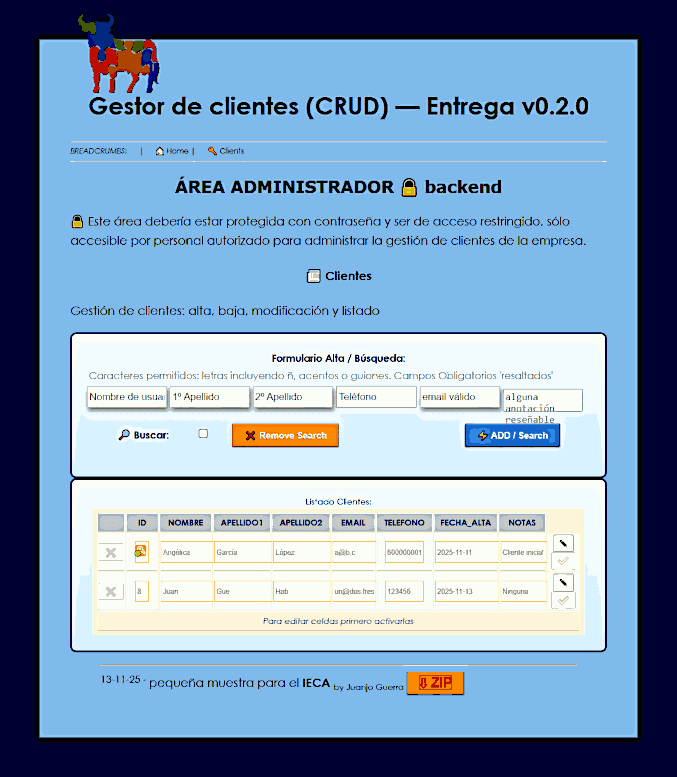

# <i style="display:none;">TOP</i>  
> -----------------------------------------------------------------------------------------------------  
>   [](https://guerratron.kesug.com/ "Página de prueba")  
> '**PHP+MySQL**' (PHP Web-APP) &emsp;-&emsp; App mínima para alta, baja, modificación y listado de clientes en MySQL.  
> Author:  Juan José Guerra Haba - <dinertron@gmail.com> &emsp;-&emsp; Nov, 2025  
> Web:     https://guerratron.kesug.com/  
> License: Free BSD. & Open GPL v.3. Keep credit, please.  
> Idea Original: **Juan J. Guerra Haba**  
> Versión: 0.3.0  
> Proyect:    PHP+MySQL Javascript &emsp; Package: WebAppCRUD.zip &emsp; Main Class: clientes.php  
> 
> ----------------------------------------------------------------------------------------------------  

<h3>🏠︎ Tabla de contenidos 🖇️</h3>

- [📖 Introducción](#📖-intro)
- [✨ Explicativo](#✨-explicativo)
- [🏷️ Resumen De Uso](#🏷️-uso)
- [🗁 Módulos JS](#🗁-modulosjs)
- [⚙️ Desarrollo](#⚙️-desarrollo)
- [💥 Pruebas Unitarias](#💥-pruebasunitarias)
- [⌨️ Preview](#⌨️-preview)
- [🚀 Aviso](#🚀-aviso)
- [✨ Mejoras](#✨-mejoras)
- [🌍 Paquete](#🌍-paquete)
- [📄 License](#📋-license)
- [🎁 Agradecimientos](#🎁-agradecimientos)
- [✒️ Credits](#✒️-credits)


# 📖-INTRO
 Gestor de clientes (CRUD) v0.3.0 <span class="small">by [GuerraTron-25][authorEmail]</span>

Entrega v0.3.0 Aplicación mínima para alta, baja, modificación y listado de clientes en MySQL.  

<pre>
Esta <i>mini-app</i> se ha desarrollado a modo de muestra para las <b>evaluaciones de certificación de profesionalidad</b> de desarrollo de apps web del <b>IECA</b>.

Se ha montado y probado tanto en <i>LOCAL</i> como en <i>SERVER</i> y funciona bien.
</pre>

No se pretende programar una app completa, tan sólo un pequeño esbozo que muestre un poco la programación en `Javascript`. 

# ✨-Explicativo
Esta api-js (api.js) trabaja en el lado del Cliente para generar y controlar los formularios de envío y recepción al servidor. Estas lecturas las realizará en el servidor de forma transparente retornandolas de vuelta en un objeto con formato JSON.

La comunicación se ha tratado de forma asíncrona a través de `XMLHTTPRequest` de forma que no existe un recargado de la web en ningún momento, tan sólo una regeneración del contenido de la tabla del listado de clientes.

La api genera al vuelo un listado con los datos consultados al server mostrando en formato tabla todos los clientes registrados. Cada fila se corresponde con un **registro** de la BD, y cada celda con un **campo**, al mismo tiempo cada fila permite acciones de editado y borrado de ese registro (hay que seleccionarlo primero) previa confirmación.

También se le han incluido unos filtros mínimos sobre los campos a ingresar (texto e email) mostrando un mensaje de aviso en caso de que los datos no sean válidos (antes de enviarlos al server).

Al mismo tiempo se compone de un formulario para las Altas/Búsqueda de clientes con filtrado también de datos.

<pre>ATENCIÓN: 🔒 La API sólo puede trabajar con protocolos web (`http://`, `https://`) no con `file:///`, ya que habría problemas `CORS`.</pre>

## 🏷️-USO
Además de incluir la etiqueta de importación de la api.js 
```html
<script type="module" src="api.js"></script>
```
Esto crea de forma global la clase `ClientsAPI` que habría que llamarla pasándole como parámetro el contendor html donde queremos visualizar la tabla creada. Por ejemplo en el evento `DOMContentLoaded` del documento.
```js
//API
document.addEventListener("DOMContentLoaded", function(){
    api = new ClientsAPI(document.querySelector("#containerEditTable"), opts);
});
```
El parámetro opcinal `opts` es un objeto al que pasar algunas características modificables de la tabla generada, como por ejemplo una referencia al **formulario de Alta/Búsqueda**, también admite unos registros a modo de ejemplo de inicio (si la BD estuviese vacía); y debe tener la siguiente estructura:
```js
let opts = {
    background: "white",
    style: "",
    formAdd: document.querySelector("#formAdd"),
    json: {
        regs: [
            /*{ id: 0, nombre: "Angélica2", apellido1: "García", apellido2: "López", telefono: "600000001", email: "angelica@dominio.com", notas: "Cliente inicial" },
            { id: 1, nombre: "Aniceto", apellido1: "Cáceres", apellido2: "Díaz", telefono: "600000002", email: "aniceto@dominio.com", notas: "VIP" }*/
        ]
    }
}
```

<pre>ATENCIÓN: 🎁 La API es **auto-suficiente**, no necesita frameworks ni librerías externas. Incluso el **CSS** necesario se **auto-importa**</pre>

## 🗁-MODULOS_JS
La api se compone de diferentes archivos js escritos en forma de módulos:
 - `Table.js`: Genera la estructura completa de la tabla entera, cargando para eso el resto de módulos necesarios.
 - `Registro.js`: Se encarga de gestionar y crear las celdas correspondientes, también genera las botoneras individuales para cada fila e implementa las llamadas elevándolas al objeto padre 'table'.
 - `Fields.js`: Finalmente este es el encargado en última instancia de generar cada una de las celdas que representan **campos** en la BD.
 - `utils.js`: Una serie de funciones estáticas de utilidad que no pertenecen a ninguna clase en concreto. En realidad este módulo exporta un **namespace** llamado **UTILS** que es el que contiene las funciones a utilizar, se ha creado así por comodidad y para que no enturbie el **alcance global**.
 - `validation.js`: Se utiliza en la validación de los campos de formulario (nombre, apellidos, email) y en las pruebas unitarias de `jasmine`.
 - `conex_conf.js`: Se ha utilizado js pero es básicamente un archivo con las CLAVES de conexionado con el servidor (protocol, host, port, path). Se importa y utiliza al inicio de la **API** y es muy importante asegurarse que se conecta al servidor correcto en función del que hayamos montado en LOCAL.

 ## STYLES
 La **API** utiliza otros archivos para dar estilo a las tablas y elementos formados, como `table-matriz.css` o alguna imágen pequeña. También utiliza **mediaquery** para el redimensionado de textos en algunos campos.

 De todas formas para aligerar contenido gráfico todos los iconos se utilizan en formato texto `unicode`, utilizando `html-entities`

<pre> ✨ PENDIENTE: Quedaría pendiente para sucesivas versiones aplicar efectos visuales atractivos al resalte de botones o a la regeneración del listado, por ejemplo.</pre>


## ⚙️-Desarrollo

No he podido dedicarle más que unas cuantas horas en estos 5 días por problemas familiares, así que no se podían hacer grandes cosas, pero he intentado cumplir lo solicitado en el PDF y que haya una muestra variada sobre programación de tecnologías web, tanto en local (con **WamppServer**) como en servidor, aplicando *buenas prácticas de programación*.

La monté en **local** y tras sucesivos tests prueba-error me decidí a montarla también **online**.

Para esto contraté un hosting en "*infinityFree*" y subí los mismos archivos que en local, sólo tube que realizar modificaciones en los datos de conexionado a la *BD* y algún pequeño ajuste más.

Puede verse montada a modo de prueba en: <https://appcrud.kesug.com/>

## 📖-DOCUMENTACION
Como se comentó en el `README.md` todos los scripts tanto en `html, css, javascript como en php` tienen líneas de comentario explicando su funcionalidad, también se ha creado este **README** y el **api.md**. Como colofón final también se ha incluido documentación en la carpeta `docs`, esta documentación sobre los archivos php se ha incluido en la ruta: `/docs/api/index.html` la cual se ha generado con `phpDocumentor 3.8.1`.

También se ha documentado el código de las clases js creadas, se encuentra todo en la carpeta `docs/js/index.html`, todo ello generado con `jsDoc`.

## 💥-PruebasUnitarias
Ejecutadas pruebas unitarias con **jasmine** al código *js* a través del archivo `tests/jasmine/SpecRunner_validation.js.html`. Este script lo he preparado específicamente para este proyecto y 
verifica multitud de variaciones de entradas a los campos del formulario, tanto a "Nombre", como a 
"Apellido" y también a "Email".

<blockquote>
    
</blockquote>

<p class="alert green">Se han probado 51 casos de uso y todas las pruebas han resultado satisfactorias: <code>51 specs, 0 failures</code>.</p>

## ⌨️-Preview

<blockquote>
    
</blockquote>

## 🚀-Aviso

<pre>Esto sólo es una pequeña demostración, no una app real.</pre>

## ✨-Mejoras
Podrían añadirse muchas mejoras, mejorar el estilo y la maquetación, aplicar efectos CSS3, optimizar más el código javascript ...

## 🌍-Paquete
He creado un paquete comprimido en formato **ZIP** con todo el proyecto, esto puede implementarse tanto en LOCAL como en SERVER, pero hay que detenerse en el archivo `bd_config.php` y establecer los datos correctos de conexionado con la Base de Datos.

Para este proyecto a mí me han servido los datos que están registrados en ese archivo, pero al trasladar el proyecto a otros PC / SERVERs habría que modificarlos.

También se ha insertado en la propia web (en el pié de la página principal) un **botón de descarga** del proyecto en su totalidad.

De todas formas, al estar versionado en GitHub, puede accederse y descargarse el **tarball**

## 🎁-Agradecimientos:  
... Muchas gracias a todos los que hacen código libre por desarrollar herramientas superútiles para todos; esta vez también a *Microsoft* por su <abbr title="Visual Studio Code">VSC</abbr> que me ha facilitado y acelerado el trabajo del desarrollo en local, .. y en general a todo el mundo altruista que genera código y lo dispone open-source.  

Por supuesto muchísimas gracias también a los asesores que he tenido durante la etapa de **Asesoramiento** en las Certificaciones que me han ayudado y aconsejado, y con antelación, también a mis futuros **Examinadores** por su interés en contactarme y facilitarme la presentación y exposición de mis trabajos y experiencia laboral.

## ✒️-Credits:
2025 - [GuerraTron-25][authorEmail] &reg; [GuerraTron Github][authorWeb]

---
⌨️ con ❤️ por [Juan José Guerra][GuerraTron-Github] 😊

[<b style="font-size:xx-large; margin-left:50%;" title="ir al inicio">🔝</b>](#top)

<!-- REFERENCIAS -->
[authorEmail]: mailto:dinertron@gmail.com
[authorWeb]: https://guerratron.github.io/
[GuerraTron-Github]: https://github.com/guerratron.github.io
